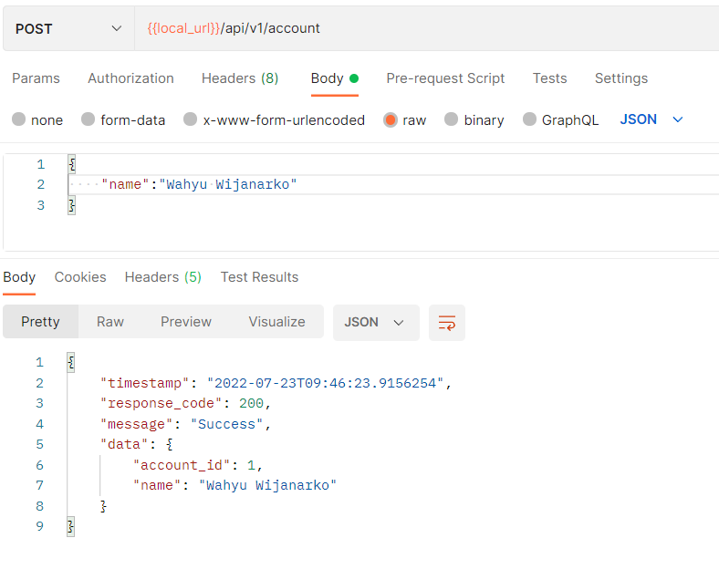
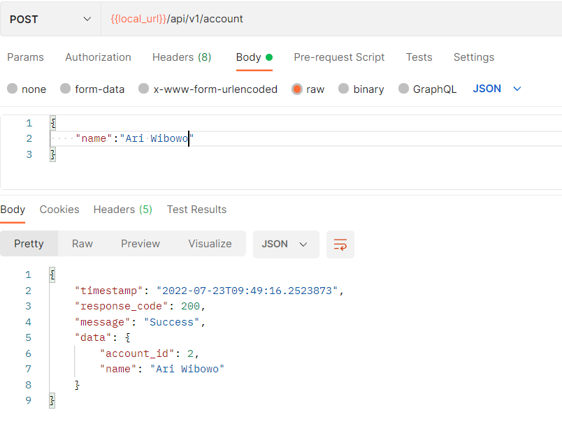
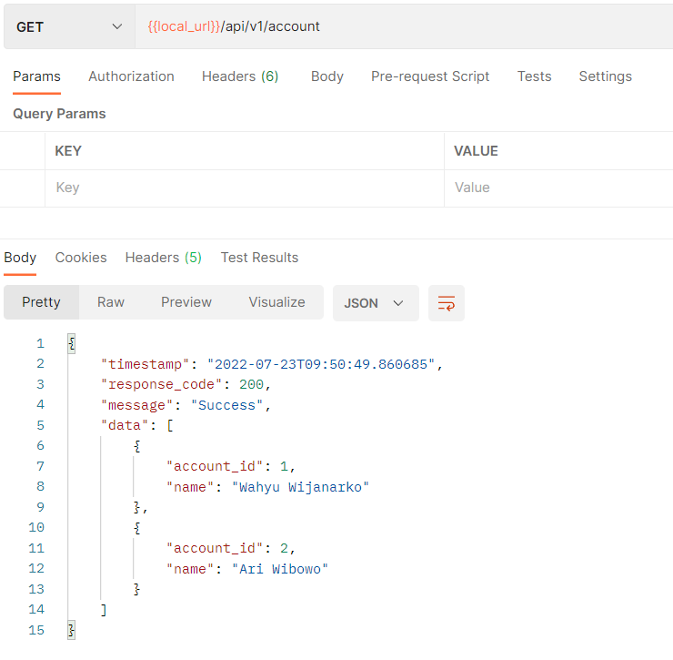
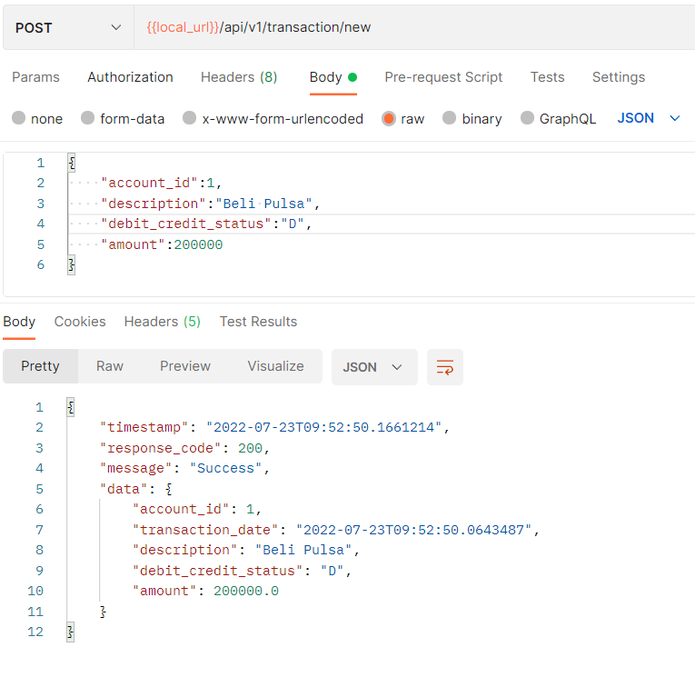
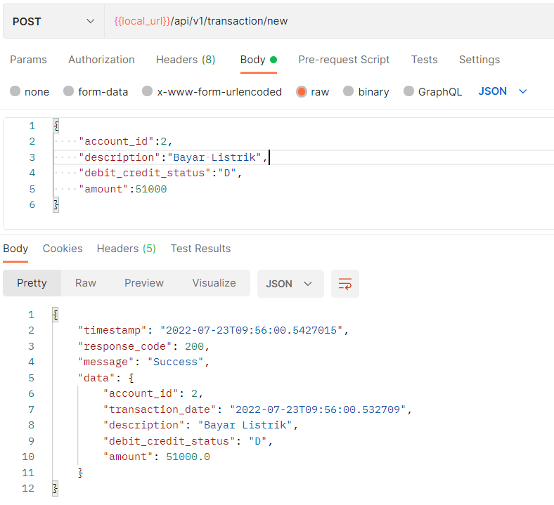
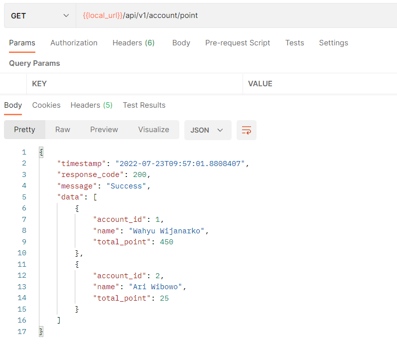
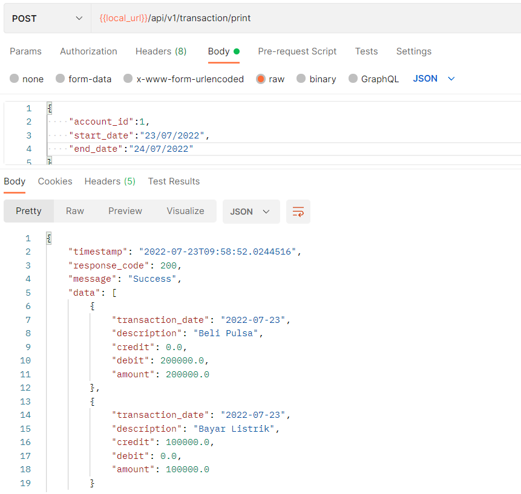
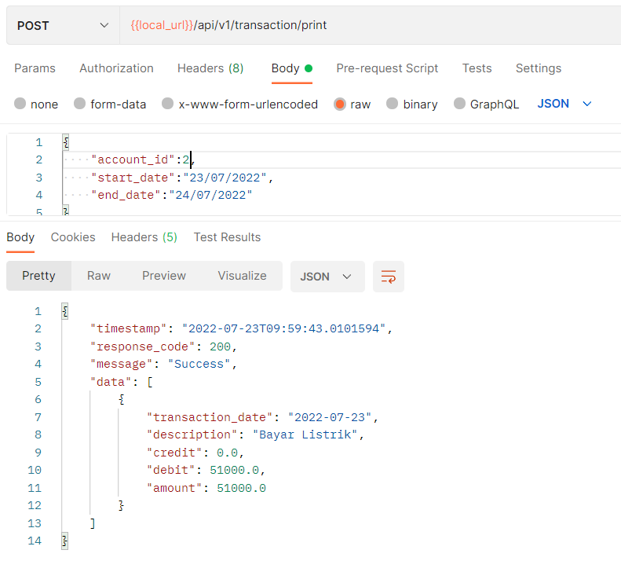

# API Customer Transaction
##### By : Wahyu Wijanarko

### Installation Guide :
1. **Buat database pada MySQL :**  
  SQL : ```create database db_custtransaction;```
2. **Konfigurasi file** [application.properties](./src/main/resources/application.properties)  
  Ubah field berikut sesuai username dan password pada MySQL yang terinstall:  
   ``spring.datasource.username=[username] default root``  
   ``spring.datasource.password=[password] default empty``
3. **Jalankan Springboot :**  
  Command : ``mvn spring-boot:run``
4. **Gunakan Postman atau Swagger untuk menggunakan API.**  
:warning:**(Pastikan Springboot telah berjalan di local)**  
[Swagger UI](http://localhost:8080/swagger-ui.html#/)
  

### Testing API :  
1. **Menambahkan data akun :**  
- **Akun 1**  
  
- **Akun 2**  
  
2. **Menampilkan seluruh data akun :**  
  
3. **Input data transaksi :**  
- **Transaksi 1**  
  
- **Transaksi 2**  
  
- **Transaksi 3**  
  
4. **Menampilkan jumlah poin tiap akun :**  
  
5. **Cetak report transaksi :**  
- **Report transaksi account_id 1 :**  
  
- **Report transaksi account_id 2 :**  
  